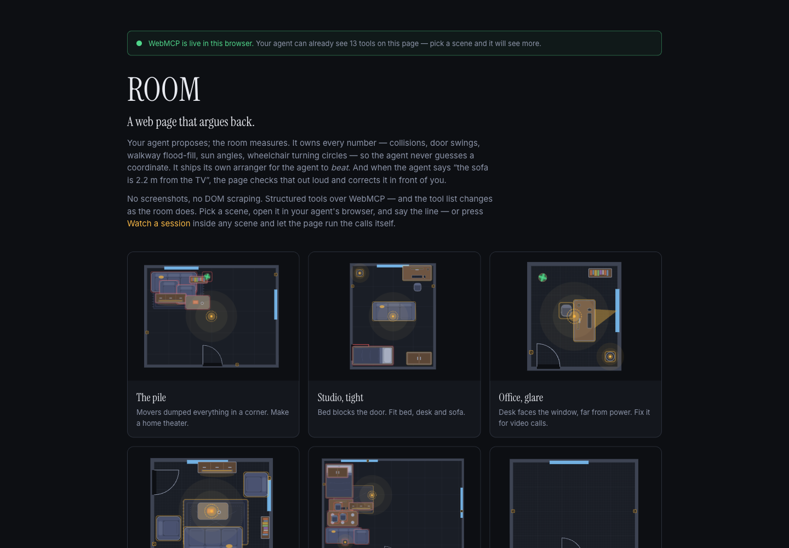

# ROOM — a web page that argues back

**Live:** https://mcp-five-puce.vercel.app · Built for the [WebMCP Challenge](https://webmcp.devpost.com/). MIT.



Most agent demos let the model drive the page. ROOM inverts it. The **page** owns every number — collisions, door swings, walkway flood-fill, solar geometry, wheelchair turning circles — and the **agent** owns intent. The agent never guesses a coordinate; it asks where things fit, and the room answers in centimetres.

Four things follow from that, and they're the point of the project:

**1. The page refuses.**
Ask it to put the sofa across the doorway and the call comes back `refused: true, moved: 0`. The furniture never moved. The page names the rule it would have broken and hands back coordinates that do work — or, if the room is too full for any to exist, the closest it can get and what each would cost. `force: true` overrides it, but only after the human has said so. A page that moves the sofa and *then* files a complaint is complying and complaining. This one declines.

**2. The page ships its own solver, so the agent has a number to beat.**
`baseline` runs a greedy arranger that knows nothing about the human, the time of day or why they asked. Its score is recorded and shown in the panel as `auto 62 → 91`. The agent's job is the gap. A demo where the page can't do the task on its own can't tell you whether the agent did anything.

**3. The page fact-checks the agent, out loud, in front of the user.**
When the agent says something measurable, it passes the measurement as a `claim`:

```js
say({ item: 'sofa', text: 'Faces the TV at 2.2m — the sweet spot for a 55"',
      claim: { kind: 'distance', a: 'sofa', b: 'tv', value: 2.2, unit: 'm' } })
```

The page measures it and appends a verdict to the bubble: **`✓ checked: the centre-to-centre distance between Sofa and TV unit is 218cm`** — or **`✗ not quite — the centre-to-centre distance between Sofa and TV unit is 282cm, not 220cm`**. Units are normalised — `m`, `mm`, and a bare fraction like 2.2, which nobody means as two centimetres. A bare *whole* number is taken at its word: an agent that correctly says 10cm to the wall used to be told it was wrong. Tolerance is the larger of 15cm and 12–15%, or 6° for an angle. This caught a real bug in this repo's own docking code during development.

**4. The human is a first-class actor, not a spectator.**
Drag a chair, rotate something, hit undo, answer a bubble — each becomes a structured event, and **every** tool result carries `humanChanges` since the agent's last call:

```json
{ "action": "moved", "item": "sofa", "from": {"x":200,"y":300}, "to": {"x":40,"y":120},
  "text": "dragged the sofa to (40,120)" }
```

So the agent notices you. There are no human-clickable automation buttons: if the agent isn't working, nothing arranges itself.

## What a page can do that a tool server can't

- **It proposes; you decide.** `move_items({propose:true})` draws each placement as a ghost with an arrow and ✓ / ✗. Nothing moves until a person clicks. A refused delete (`remove_item`) or a room replacement (`set_room`) *blocks the tool call itself* until the human answers a bubble — read tools run free, destructive ones wait for a person.
- **It remembers what you refused.** Every rejection is stored in the browser and handed to the *next* agent that opens the room as `learned` — "the human rejected moving the sofa to (160,250)". A new session doesn't repeat last week's argument.
- **It speaks first.** WebMCP is agent→page. The only thing a page can do unprompted is change its own tool list, and the browser fires `toolchange` when it does. So when you refuse a proposal or type a reply, the page registers a transient tool named `read_message_from_human` whose *description is the message*. Calling it returns the message and unregisters it. Verified in Chrome 152: both register and abort fire `toolchange`.
- **It draws the room for a blind agent.** `get_room` returns a 20 cm ASCII map with a legend — an LLM reasons about a picture far better than about a list of rectangles.
- **It fact-checks even a lazy agent.** If `say()` has a measurement in it and no `claim`, the page infers one — "2.2 m from the TV" → a distance claim against `tv` — and checks it anyway.
- **It ships the plan in a link.** `share()` encodes the whole room into the URL hash. No server, no account.

## Using WebMCP properly

Verified against Chrome 152 (`document.modelContext` — not `navigator.modelContext`; `executeTool` passes and returns JSON *strings*).

- **`annotations.readOnlyHint`** on all ten tools that only read (`get_room`, `sense_room`, `find_space`, `measure`, `access_check`, `bedside_check`, `work_triangle`, `rooms`, `share`, `plan_sheet`), so an agent can look without a confirmation prompt. `destructiveHint` on the seven that replace rather than add.
- **`annotations.untrustedContentHint`** on the seven tools that can hand back text a *person* typed — a free-text reply, a save's name, or `brief.who` ("kids", "my dad"), which rides along in every snapshot of the room. None of it is content this site authored.
- **`title`** on every tool, for clients that show a human-readable label.
- **The tool list is not fixed.** Tools are registered and unregistered with an `AbortSignal` as the room changes, and Chrome fires `toolchange`. A blank room exposes **13** tools, a furnished one **22**, and standing back at a whole home **15**. Fifteen of the twenty-eight come and go; the conditions are under the tool table above. Switch the goal to accessibility and **`access_check`** appears — a tool that did not exist a second earlier. Refuse a proposal and **`read_message_from_human`** appears. The panel shows the live list and highlights what just arrived.

- **`isError`** is set on failed results per the MCP convention. Worth knowing: Chrome 152's `executeTool` flattens a result to its text content, so the flag doesn't currently survive the trip — which is why every failure *also* carries a plain `{ "error": "…" }` in the payload itself. Belt and braces until the browser catches up.

That is the difference between "I put my API behind WebMCP" and "the page is a participant".

## Why a floor plan, and why it isn't really about floor plans

A room is the smallest honest example of a problem the web is full of: **a page holding a model the
agent cannot see.** The geometry is not in the DOM. There is no screenshot from which you can read
that a wheelchair needs 150cm to turn, that this wall gets the four o'clock sun, or that 62cm is not
a corridor. An agent looking at pixels can only guess, and it will guess confidently.

So the split ROOM makes is not a furniture idea. It is: *the page owns the model and the judgement,
the agent owns the intent.* Everything else follows from that — the agent never invents a
coordinate, the page refuses a move that breaks a rule it can prove, and a claim the agent makes out
loud gets checked against the geometry before the human reads it.

That shape fits a long list of pages that have nothing to do with sofas:

| The page | The model an agent cannot see |
|---|---|
| Seating plans | sightlines, fire exits, who must not sit together |
| Warehouse racking | reach heights, turning radius, pick paths, weight per bay |
| Stage and lighting rigs | rigging loads, focus angles, cable runs, sightlines |
| PCB and rack layout | clearances, thermals, trace length, airflow |
| Shift and theatre rosters | rest rules, competency cover, who is on call |
| Storefront merchandising | stock depth, planogram rules, adjacency |
| Garden and planting plans | sun hours, mature spread, root spread, hardiness |

Every one of them today gets an agent that reads the screen and proposes something plausible and
wrong, and a human who has to catch it. Every one of them could instead hand the agent a `find_space`,
a `check` and a refusal. **The furniture is the demo. The stance is the point.**

## The 28 tools

| | |
|---|---|
| **Read** | `get_room` · `sense_room` · `find_space` · `measure` · `access_check`\* · `bedside_check`\* · `work_triangle`\* |
| **Ask** | `brief` — how many people, doing what, called what |
| **Place** | `move_items` · `arrange` · `dock_item` · `add_item` · `remove_item` · `baseline` · `undo` |
| **Talk on the plan** | `say` (bubble, pin, banner, question, verified claim) · `show` (highlight, walking route, 2D/3D, **sit inside**) |
| **Home** | `define_flat` · `rooms` · `enter_room` |
| **Scene** | `set_profile` · `sun` · `layouts` · `set_room` · `share` · `saves` · `plan_sheet` · `preset` |
| **Transient** | `read_message_from_human` — exists only while the page has something to tell the agent |

\* contextual — fifteen of the twenty-eight come and go with the state of the room, because the tool
list *is* the state: `access_check` only in the accessibility profile (which a bathroom sets by
itself) · `bedside_check` only where there is a bed · `work_triangle` only where there is a hob or a
sink · `measure` and `arrange` only with two things to relate · `dock_item` only when something in the
room has a host to dock to · `undo` only once there is something to undo · `rooms` and `enter_room`
only inside a home · `plan_sheet` only when there is something to draw, this room or any room of the
home · `move_items`, `remove_item`, `baseline`, `layouts` and `share` only once the room has something
in it.

Every result opens with a one-line `status` the agent can read without parsing — `"41/100 · 7 problems (4 must fix) · 2 human changes since your last call"` — and `get_room` opens with a plain-English `overview` of the room.

**`brief` is the tool that stops the layout being technically correct and humanly wrong.** A collision check cannot tell a desk for one from a desk for five, so the agent has to ask: how many people, doing what. Asked for a study room for five kids, an agent will happily satisfy the count by pushing five desks into one 700 cm slab — legal geometry, and a conference table. Once the brief is set the page counts places, personal desks and chairs against the actual people, and `sense_room` reports what *touches* what, because two pieces that touch read as one object no matter what the item list says:

> `desk_1, desk_2, desk_3, desk_4, desk_5 are pushed together into one 700cm run — that reads as a single shared table, not 5 places to work`
> → *more than 15cm between them and they stop reading as one table — leave 20 and each one is clearly somebody's own desk*

**`arrange` is the verb that was missing.** A rule that says *leave more than 15cm between them* is useless if the only way to obey it is to hand-compute five coordinates — that is the guessing this project exists to prevent. `arrange` composes a whole set in one call: `align` to a shared edge, `gap` to an exact spacing, `as: 'row' | 'column' | 'grid'` to lay them out fresh, `centre` on the room or on another piece, `facing` an item they should all turn towards.

Two details matter more than the API. A group laid out afresh **turns as one thing** — five desks facing the board all face the same way, judged from where the group will end up; compute it per piece from where each one happens to stand and one of the five ends up sideways. And if the composition runs past a wall the **whole group slides back**, because clamping each piece separately turns the even spacing you asked for into 40, 40, −30.

**`find_space` is the tool the whole design rests on, so it takes the agent's intent seriously:** `id` re-places an existing item (size and type inferred, current position ignored); `ignore` lists items about to move, so re-planning a full room isn't judged against the mess being cleared; `plan` lists placements chosen but not yet applied, so a batch of searches can't return five spots stacked on each other. Without those, an agent re-planning a tight room gets nothing back and falls back to inventing coordinates — which is exactly the failure this project exists to prevent. When nothing legal exists it returns `least_bad` with what each spot would hit, so there is always a real coordinate to negotiate with.

## Sitting in the room

`show({eye: 'chair_b', eye_height: 115})` drops the camera into that seat, at that person's eye height, facing the way they face. It is the argument a plan cannot make: instead of *"the sofa narrows the route to 62 cm"*, the human is in the wheelchair by the door, looking at it. A chip at the bottom says whose eyes these are and offers **stand up**, so nobody is ever stuck inside the room.

No tool server can do this. The page owns the geometry, the renderer and the screen — the agent only has to know when to ask.

## A home is not one room

`define_flat({ bedrooms: 2, people: 4 })` builds a **2BHK**: a hall, two bedrooms, a kitchen and a
bathroom at ordinary sizes. It works out who sleeps where — the main bedroom takes the couple, the
rest spread evenly, nobody sleeps in the hall — and gives each room the goal it should be judged
against. You stand in one room at a time; `enter_room` moves you, and what you did stays behind you.

**The tool list is the agent's location.** This is the thing WebMCP lets a page do that nothing else
does, and a home is where it stops being a party trick:

| Walk from | to | and the agent's tools change |
|---|---|---|
| hall | bathroom | **gains `access_check`** — a bathroom is judged on turning space whether or not anyone asked |
| empty bedroom | bedroom with a bed | **gains `bedside_check`** — 60cm each side to get out, 90 where the room is judged on accessibility, or a double bed sleeps one |
| bedroom | kitchen | **loses `bedside_check`** — there is no bedside here |
| empty kitchen | kitchen with a hob | **gains `work_triangle`** — sink, hob, fridge; 360–660cm or you walk miles cooking |

Nobody described the room to the agent. It found out where it was standing by reading its own tools.

And you can see it whole. The home draws as one plan — rooms laid out in columns, the walls between
them, doors as gaps in the walls, windows in blue, the furniture in each. Click a room to stand in
it. The wall mass is the union of each room's envelope rather than a bounding box, because a bounding
box invents a phantom room wherever one column is shorter than its neighbour; real flats are rarely
rectangles.

`rooms()` gives the whole home at a glance — each room's size, who sleeps there, what it scores, and
which ones are still empty. An empty room breaks no rule and so scores 100, which would report a
perfect home before anything was unpacked, so only furnished rooms count towards the total.

`plan_sheet` on a home prints the lot: a cover with the whole floor plan and a table of every room,
then each room on its own page with its own dimensions and schedule.

## Watching it work without an agent

Most people who open this page have no WebMCP agent attached, and the argument the page makes is
invisible without one. So every scene ships a **scripted session** — press *Watch a session* and the
page runs the same calls a real agent makes, through the same `window.room` entry point the tools
already expose. Nothing is faked: each step is a real tool call mutating the real room, narrated by
the real transcript. Each scene tells a different story — contextual tools appearing, an `arrange`
composing five pieces at once, a claim being checked in public, ghosts waiting on a human's ✓.

A test runs every step of every script on every commit, because a broken demo is worse than none.

## Saving

Everything is kept in `localStorage`, on the machine that made it — there is no account and nowhere to upload to. The header carries a shelf of up to twelve named rooms with a `×` on each, so the human deletes their own work rather than asking us to. The agent reaches the same shelf through `saves({action, name})` — saving a room before rearranging it is a thing an agent should be able to offer, and it could not until it had the tool. The session is also remembered as you go, and the landing page *offers* it back as a card rather than dropping you into it: arriving somewhere you did not ask for is worse than one extra click, and a first look at the page should always be the same first look.

`layouts` is a different thing and stays a different thing: it is the agent's scratch space for
showing option A against option B. In a home those options belong to the room they were drawn for and
come back with it, rather than following you into the kitchen or being quietly thrown away on the way
out.

Three keys, and they are looked after:

- **Every write goes through one function.** A browser refuses for two different reasons — private
  mode says no from the start, a full quota says no once — and only the second is worth recovering
  from. When a write does not fit, the room memories nobody has touched in longest are dropped and
  the write is retried; if it still fails the page says so in the panel rather than pretending, and
  points at `share()`, which stores nothing at all.
- **Room memories are capped.** Every distinct room shape ever opened used to leave a key behind for
  good — five or more per home, one per shared link, and nothing ever removed one. Given long enough
  that fills the origin's quota and then *nothing* saves.
- **Nothing read back is trusted.** Whatever is in storage was put there by an older version of this
  page, or by hand, so a lesson list that turns out to be a string is discarded rather than rendered.

## The rules

28 rules, filtered by goal. Beyond the obvious (overlap, bounds, door swing) the interesting ones are the ones that encode taste and lived experience — and one that encodes neither:

- **Everything reachable** — 10 cm grid, k×k erosion, BFS flood-fill from the doors. It genuinely proves a corridor of the required width exists, rather than measuring a straight line.
- **Nobody walks through the view** — segment intersection between the first steps in from each door and each seat→screen sightline.
- **Nobody sits back-to-door**, **bed off the window wall**, **rug anchors the seating**, **furniture not all shoved to the walls**, **pairs sit together** (a desk chair belongs at the desk, a coffee table 45 cm in front of the sofa).
- **Close enough to talk** — seats that actually address each other are held to the 3.5–10 ft band designers work to; further and you raise your voice, closer and it is knee to knee. Seats that merely sit side by side are left alone.
- **You do not walk in behind the sofa** — the oldest rule in the book, and one a collision check will never find: the first thing you meet through the door should not be an upholstered back.
- **Pieces are in proportion** — a coffee table wants to be half to two-thirds of its sofa. Smaller reads as an afterthought, larger swamps the seating.
- **Everyone has a place of their own** — counts places, desks and chairs against the people in the brief, and catches the layout that satisfies the count on paper by welding the desks together.
- **Tall pieces against a wall** — a wardrobe has an unfinished back and a bed has a headboard. It also tells apart *stranded in the middle* from *against the wall but facing it*, because those need opposite fixes.
- **No window glare** — and, since a rule you cannot satisfy is a bug, the catalogue has a blind. `dock_item({id, to:'east window'})` hangs it, cut to the window's width, and the window stops glaring.
- **Everything fits** — when something genuinely doesn't, it is *set aside* into a tray under the plan, not piled on the door. It breaks no rule and can be brought back. An empty room scores 100, not 0.
- **Sockets clear of water** — the one rule here that is not a matter of taste. No socket within 60cm of a bath, shower, basin or sink (IEC 60364-7-701), under every profile, as an error rather than a warning. Every other rule is about how a room feels; this one is about electrocution.

Overlaps are reported per heap, not per pair: seven pieces shoved into a corner is one problem with seven names in it, not twenty-one lines that push every other rule out of view. Scoring counts distinct problems too.

## The page itself

A project arguing that a wheelchair user should be able to get around a room had better be usable
without a mouse and without sight. Every control is a real button with a real name, so the whole page
tabs. The plan carries `role="img"` and a description of what it would tell you if you could see it —
*"Floor plan. 420 by 360 centimetres, 1 door, 2 windows. 9 pieces: tv unit, sofa, armchair… 2
problems: Rug is adrift from Sofa…"*. The transcript and the score are `aria-live`, because the whole
premise is a page that tells you things, and it was telling them silently.

## Accessibility is real geometry, not a label

The `accessibility` profile isn't a stricter number on a corridor. It re-checks the room as a wheelchair user:

- **150 cm turning circles.** For every destination — bed, sofa, desk, wardrobe, screen — the page proves whether a 150 cm square that *connects to the route from the door* exists beside it, and **draws the circle it found** on the plan. Green where one fits, pulsing red where none does.
- **90 cm corridors** (vs 60), and 150 cm of door clearance in both axes.
- **90 cm transfer space** beside a bed, not 60 — enough to pull a chair alongside, an `error` rather than a warning.
- **120 cm approach** at tables and desks instead of a 75 cm chair pull-out.
- **Sockets within reach** — a bookshelf across the only outlet is flagged; nobody seated can reach the plug.

`access_check` returns all of it as numbers: circle centres, route lengths, blocked sockets, a plain-English verdict.

## Sunlight

Real solar geometry, not a lookup table: the sun rises east, peaks due south, sets west, altitude and day length shifting by season. Tell the page which way the room faces (`sun({north, season})`, or the picker) and the beams through each window swing accordingly — a low winter sun throws light 5 m across the floor, a high summer noon barely a metre. Glare is evaluated against the actual sun vector, so the agent can answer *"will the screen glare at 3pm in July?"* with a schedule.

## Lighting

Nine fixtures with real behaviour — reach, colour temperature, layer (ambient / task / accent / mood). The **Lit after dark** rule flags any zone out of reach of a fixture, and a desk lit only from overhead ("you would work in your own shadow"). Slide daylight past 19:00 and the room actually goes dark.

## Views

2D plan and a 3D walkthrough (`?view=3d`, walls facing the camera cut away). You can drag furniture in both — same store, same rules, same `humanChanges` — rotate with `R`, nudge with arrows, delete with ⌫. `show({view:'3d'})` switches the human's view.

## Run

```
npm i
npm run dev        # http://localhost:5173/?preset=living-pile
npm test
npm run mutate     # breaks the page on purpose, checks the tests notice
npm run coverage   # what the suite never runs
```

While `npm run dev` is up, `/spike.html` is the day-1 probe: which WebMCP API
this browser actually has, and whether late registration works.

`spike.html` is 25 lines and answered the first question this project had: is it
`navigator.modelContext` or `document.modelContext`, and does registering a tool
*after* page load reach the agent. It is a dev page, not part of the site.

**Clients.** The ChatGPT desktop app's in-app browser has WebMCP on by default. In Chrome 149+, enable `chrome://flags/#enable-webmcp-testing` and relaunch. The landing page shows a green light when the page can see `document.modelContext`, and the panel's *Your agent* section reads **tools registered (WebMCP)**. Everything in this README was verified in Chrome 152 through the raw API; the ChatGPT client was tested by hand for the tool calls, not for `toolchange` re-listing — every tool result also carries `humanChanges`, so nothing depends on it.

Without the flag everything still works, and every tool is callable from DevTools:

```js
await window.room.get_room()
await window.room.find_space({ type: 'sofa', facing: 'tv' })
await window.room.list_tools()        // what the agent can see right now
```

Nothing leaves the browser. No network calls, no server, no accounts — what the page remembers (saves, refusals, the session) lives in this browser's `localStorage` and nowhere else.
